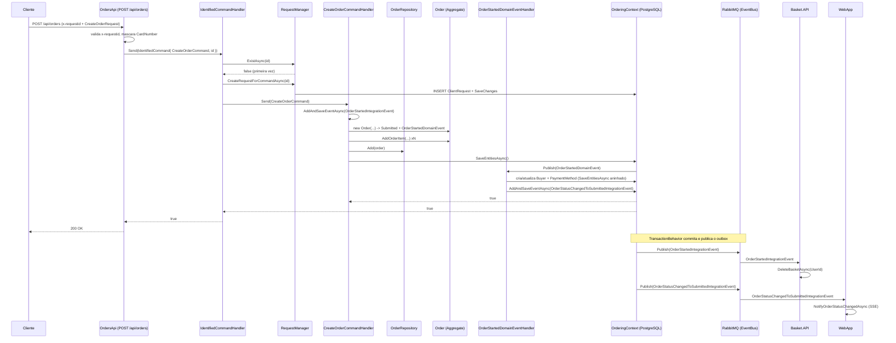
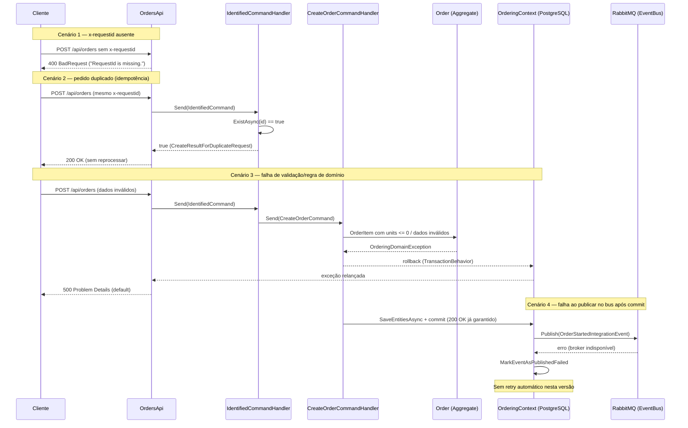

# Diagrama de Fluxo — Order (Create)

> **Instruções para a LLM**
>
> - [x] Substitua os placeholders `{...}` pelos dados reais.
> - [x] Siga o fluxo abrindo somente o próximo elemento invocado; não leia arquivos aleatórios.
> - [x] **Orçamento de exploração:** no máximo {8} arquivos abertos durante a Etapa 0. Se esse limite for atingido sem localizar o ponto de entrada, pare e registre o bloqueio na Etapa 0 em vez de continuar abrindo arquivos ao acaso.
> - [x] Preencha a tabela de passos ANTES de desenhar os diagramas.
> - [x] Complete os blocos Mermaid com o fluxo real; apague o exemplo.
> - [x] Marque itens não aplicáveis como `N/A`.
> - [x] Esta é a **fonte única** da cadeia de rastreio Endpoint → Integration Event. `study-case.md` referencia esta tabela, não a duplica.

## Etapa 0 — Reconhecimento do projeto

> Só necessária na primeira vez que este projeto é estudado, ou se a estrutura mudou desde o último estudo. Se já souber onde entrar, marque como `N/A` e vá para a Etapa 1.

- [x] **Como o roteamento é definido?** Minimal APIs com `RouteGroupBuilder` — `app.MapGroup("api/orders")` em `src/Ordering.API/Apis/OrdersApi.cs`, exposto via `app.NewVersionedApi("Orders")` em `Program.cs:19-22`.
- [x] **Existe documentação viva (Swagger/OpenAPI, GraphQL schema, etc.)?** Sim — `AddDefaultOpenApi()` (`Program.cs:13`, `app.UseDefaultOpenApi()` em `Program.cs:24`).
- [x] **Ponto de partida usado para localizar o endpoint:** Busca por texto (`MapPost`, `CreateOrderAsync`, `CreateOrderCommand`) → `OrdersApi.cs`.
- [x] **Convenção de nomes do projeto:** `CreateOrderCommand` / `CreateOrderCommandHandler`; idempotência via `IdentifiedCommand<T,R>` / `IdentifiedCommandHandler<T,R>`; endpoints como métodos estáticos em `Apis/*Api.cs`; eventos de integração em `Application/IntegrationEvents`; behaviors de pipeline em `Application/Behaviors`.
- [x] **Bloqueios encontrados nesta etapa:** N/A.

## Etapa 1 — Ponto de entrada

- [x] Procurar no projeto por: `MapPost`, `CreateOrderAsync`, `CreateOrderCommand`, `CreateOrderRequest`
- [x] **Rota:** `POST /api/orders` (grupo `api/orders`, versão 1.0)
- [x] **Método:** POST
- [x] **Entrada:** header `x-requestid: Guid` + body `CreateOrderRequest` (dados de entrega, cartão e `Items`)
- [x] **Autenticação:** JWT Bearer (`.RequireAuthorization()` no grupo)
- [x] **Retorno:** `200 OK`; `400 BadRequest` se `x-requestid` vazio

## Etapa 2 — Caminho do código (caminho feliz)

Acompanhe a cadeia na ordem, registrando o arquivo de cada elemento:

- [x] **Endpoint** `src/Ordering.API/Apis/OrdersApi.cs:118` → mascara o cartão, cria `CreateOrderCommand` e envolve em `IdentifiedCommand<CreateOrderCommand, bool>` (linha 146)
- [x] **Command** `src/Ordering.API/Application/Commands/CreateOrderCommand.cs` → transporta dados imutáveis do pedido (`IRequest<bool>`)
- [x] **Idempotency Handler** `src/Ordering.API/Application/Commands/IdentifiedCommandHandler.cs:39` → `RequestManager.ExistAsync` / `CreateRequestForCommandAsync`
- [x] **Handler** `src/Ordering.API/Application/Commands/CreateOrderCommandHandler.cs:29` → orquestra o caso de uso (enfileira `OrderStartedIntegrationEvent`, cria `Address`, `Order`, itens)
- [x] **Repository** `src/Ordering.Infrastructure/Repositories/OrderRepository.cs:15` → `Add(order)`
- [x] **Aggregate** `src/Ordering.Domain/AggregatesModel/OrderAggregate/Order.cs:52` → construtor (status `Submitted`, `OrderStartedDomainEvent`) + `AddOrderItem()` (linha 71)
- [x] **Unit of Work** `src/Ordering.Infrastructure/OrderingContext.cs:47` → `SaveEntitiesAsync()` → `DispatchDomainEventsAsync` + `SaveChangesAsync`
- [x] **Domain Event** `OrderStartedDomainEvent` → `src/Ordering.API/Application/DomainEventHandlers/ValidateOrAddBuyerAggregateWhenOrderStartedDomainEventHandler.cs:20` (cria Buyer + PaymentMethod e enfileira `OrderStatusChangedToSubmittedIntegrationEvent`)
- [x] **Integration Event** publicado no bus via outbox: `OrderStartedIntegrationEvent` e `OrderStatusChangedToSubmittedIntegrationEvent` — `TransactionBehavior.cs:52` → `OrderingIntegrationEventService.PublishEventsThroughEventBusAsync`

### Exemplo de rastreio (modelo de referência)

- [x] `app.MapPost("/")` (grupo `api/orders`) → `IdentifiedCommand<CreateOrderCommand, bool>`
- [x] `CreateOrderIdentifiedCommandHandler` (idempotência via `RequestManager`) → `CreateOrderCommandHandler` → `orderRepository.Add(order)` → `SaveEntitiesAsync()` → dispatches `OrderStartedDomainEvent` → outbox publicado

## Etapa 3 — Tabela de passos

- [x] Preencha antes de desenhar qualquer diagrama (evita diagrama bonito, porém incorreto).

| Passo | Componente | Responsabilidade | Entrada | Saída |
|-------|------------|------------------|---------|-------|
| 1 | `OrdersApi.CreateOrderAsync` (`OrdersApi.cs:118`) | Validar `x-requestid`, mascarar cartão, montar command | `CreateOrderRequest` + header `x-requestid` | `IdentifiedCommand<CreateOrderCommand, bool>` |
| 2 | `IdentifiedCommandHandler.Handle` (`IdentifiedCommandHandler.cs:39`) | Garantir idempotência | IdentifiedCommand | `true` (duplicado) ou despacho do command interno |
| 3 | `RequestManager` (`RequestManager.cs:13,21`) | Persistir chave de idempotência | `Guid x-requestid` | linha em `ClientRequest` + `SaveChanges` |
| 4 | Behaviors de pipeline (`Logging`→`Validator`→`Transaction`) | Log, validação FluentValidation, transação | `CreateOrderCommand` | command validado dentro de transação |
| 5 | `CreateOrderCommandHandler.Handle` (`CreateOrderCommandHandler.cs:29`) | Orquestrar criação | `CreateOrderCommand` | `Order` + `OrderStartedIntegrationEvent` no outbox |
| 6 | `Order` ctor + `AddOrderItem` (`Order.cs:52,71`) | Aplicar invariantes do agregado | dados do command | `Order` (Submitted) com `OrderItems` |
| 7 | `OrderRepository.Add` (`OrderRepository.cs:15`) | Registrar no EF | `Order` | entidade tracked |
| 8 | `OrderingContext.SaveEntitiesAsync` (`OrderingContext.cs:47`) | Disparar domain events + persistir | tracked entities | domain events dispatchados, commit |
| 9 | `ValidateOrAddBuyerAggregateWhenOrderStartedDomainEventHandler` | Criar/atualizar Buyer + PaymentMethod; enfileirar evento | `OrderStartedDomainEvent` | `Buyer` + `OrderStatusChangedToSubmittedIntegrationEvent` no outbox |
| 10 | `TransactionBehavior` (`TransactionBehavior.cs:38,52`) | Commit da transação + publish dos eventos do outbox | transação | `200 OK`; eventos no RabbitMQ |

## Etapa 4 — Diagrama de sequência (caminho feliz)

- [x] O diagrama de sequência mostra a **ordem temporal** das interações.
- [x] Use Mermaid para manter o diagrama versionável em Markdown.



## Etapa 5 — Diagrama estrutural

- [x] O diagrama estrutural responde: **quais componentes existem e como estão conectados?**
- [x] Use junto com o de sequência quando houver mensageria ou comunicação assíncrona.

```mermaid
flowchart LR
    C[{Cliente/WebApp/ClientApp}] --> E[OrdersApi POST /api/orders]
    E --> I[IdentifiedCommandHandler]
    I --> RM[RequestManager<br/>ClientRequest]
    I --> H[CreateOrderCommandHandler]
    H --> R[OrderRepository]
    R --> D[(PostgreSQL<br/>OrderingContext + IntegrationEventLog)]
    H --> O[OrderingIntegrationEventService<br/>Outbox]
    D --> TR[TransactionBehavior<br/>Commit]
    TR --> B{RabbitMQ}
    B --> BAS[Basket.API<br/>DeleteBasket]
    B --> WEB[WebApp<br/>OrderStatusNotificationService]
    B --> CAT[Catalog.API<br/>valida estoque (downstream)]
    B --> PP[PaymentProcessor<br/>pagamento (downstream)]
    B --> OP[OrderProcessor<br/>grace period (downstream)]
```

## Etapa 6 — Diagrama de sequência (caminhos de erro)

- [x] Use a tabela "Caminhos de erro e exceção" do `study-case.md` como base.
- [x] Não é obrigatório desenhar todos os cenários de erro — priorize os que têm efeito colateral ou compensação (não apenas um 4xx simples).
- [x] Se nenhum caminho de erro tiver complexidade suficiente para justificar um diagrama, marque como `N/A` e explique por quê.



## Checklist final

- [x] Etapa 0 concluída ou marcada `N/A`
- [x] Endpoint localizado com rota/método registrados
- [x] Cadeia Endpoint → ... → Integration Event rastreada
- [x] Tabela de passos preenchida
- [x] Diagrama de sequência (caminho feliz) criado
- [x] Diagrama estrutural criado
- [x] Diagrama de sequência (erro) criado ou justificadamente marcado `N/A`
- [x] Conexões assíncronas representadas nos diagramas aplicáveis
