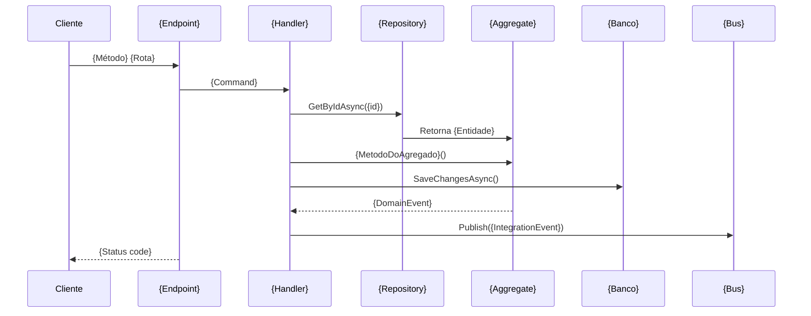
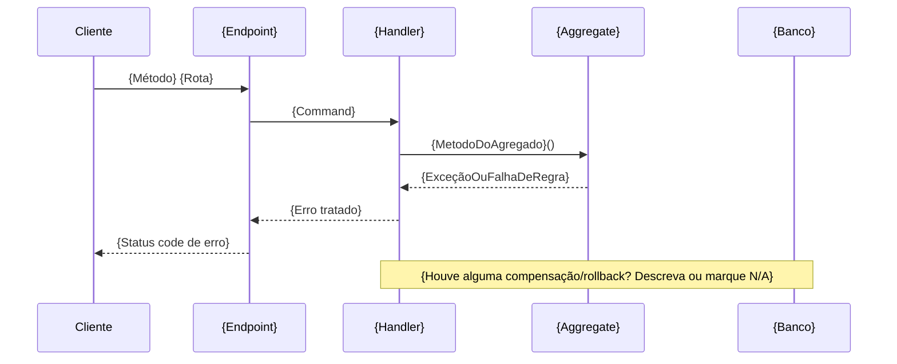

# Diagrama de Fluxo — {Entidade} ({Endpoint})

> **Instruções para a LLM**
>
> - [ ] Substitua os placeholders `{...}` pelos dados reais.
> - [ ] Siga o fluxo abrindo somente o próximo elemento invocado; não leia arquivos aleatórios.
> - [ ] **Orçamento de exploração:** no máximo {8} arquivos abertos durante a Etapa 0. Se esse limite for atingido sem localizar o ponto de entrada, pare e registre o bloqueio na Etapa 0 em vez de continuar abrindo arquivos ao acaso.
> - [ ] Preencha a tabela de passos ANTES de desenhar os diagramas.
> - [ ] Complete os blocos Mermaid com o fluxo real; apague o exemplo.
> - [ ] Marque itens não aplicáveis como `N/A`.
> - [ ] Esta é a **fonte única** da cadeia de rastreio Endpoint → Integration Event. `study-case.md` referencia esta tabela, não a duplica.

## Etapa 0 — Reconhecimento do projeto

> Só necessária na primeira vez que este projeto é estudado, ou se a estrutura mudou desde o último estudo. Se já souber onde entrar, marque como `N/A` e vá para a Etapa 1.

- [ ] **Como o roteamento é definido?** {Minimal API / Controllers / Convenção de pastas (ex.: Flutter go_router) / Outro}
- [ ] **Existe documentação viva (Swagger/OpenAPI, GraphQL schema, etc.)?** {Sim/Não — link ou caminho}
- [ ] **Ponto de partida usado para localizar o endpoint:** {Busca por texto (`{keywords}`) / Swagger UI / Arquivo de rotas central / Outro}
- [ ] **Convenção de nomes do projeto:** {ex.: Commands terminam em `Command`, Handlers em `CommandHandler`, etc. — ajuda a prever onde procurar o próximo elo}
- [ ] **Bloqueios encontrados nesta etapa:** {N/A ou descrição — se houver bloqueio que impede seguir, registre aqui e escale para "Perguntas em aberto" no `study-case.md`}

## Etapa 1 — Ponto de entrada

- [ ] Procurar no projeto por: `{Keywords de busca}` (ex.: MapPost, HttpPost, ConfirmOrder, PlaceOrder, Checkout, CreateOrderCommand)
- [ ] **Rota:** {Rota}
- [ ] **Método:** {Método HTTP}
- [ ] **Entrada:** {Parâmetros/body}
- [ ] **Autenticação:** {Tipo de auth}
- [ ] **Retorno:** {Status codes}

## Etapa 2 — Caminho do código (caminho feliz)

Acompanhe a cadeia na ordem, registrando o arquivo de cada elemento:

- [ ] **Endpoint** `{Arquivo:linha}` → cria/envia `{Command}`
- [ ] **Command** `{Arquivo:linha}` → transporta `{Dados}`
- [ ] **Handler** `{Arquivo:linha}` → orquestra o caso de uso
- [ ] **Repository** `{Arquivo:linha}` → `GetByIdAsync({id})`
- [ ] **Aggregate** `{Arquivo:linha}` → `{MetodoDoAgregado}()` aplica regras
- [ ] **Unit of Work** `{Arquivo:linha}` → `SaveChangesAsync()`
- [ ] **Domain Event** `{Evento}` registrado/despachado
- [ ] **Integration Event** `{Evento}` publicado no bus

### Exemplo de rastreio (modelo de referência)

- [ ] `app.MapPost("/orders/{id}/confirm", ...)` → `ConfirmOrderCommand`
- [ ] `ConfirmOrderCommandHandler` → `repository.GetByIdAsync(...)` → `order.Confirm()` → `unitOfWork.SaveChangesAsync()`

## Etapa 3 — Tabela de passos

- [ ] Preencha antes de desenhar qualquer diagrama (evita diagrama bonito, porém incorreto).

| Passo | Componente | Responsabilidade | Entrada | Saída |
|-------|------------|------------------|---------|-------|
| 1 | {Componente} | {Responsabilidade} | {Entrada} | {Saída} |
| 2 | {Componente} | {Responsabilidade} | {Entrada} | {Saída} |
| 3 | {Componente} | {Responsabilidade} | {Entrada} | {Saída} |

## Etapa 4 — Diagrama de sequência (caminho feliz)

- [ ] O diagrama de sequência mostra a **ordem temporal** das interações.
- [ ] Use Mermaid para manter o diagrama versionável em Markdown.



## Etapa 5 — Diagrama estrutural

- [ ] O diagrama estrutural responde: **quais componentes existem e como estão conectados?**
- [ ] Use junto com o de sequência quando houver mensageria ou comunicação assíncrona.

```mermaid
flowchart LR
    A[{Cliente}] --> B[{Endpoint}]
    B --> C[{Handler}]
    C --> D[{Repository}]
    D --> E[(Banco: {Banco})]
    C --> F[{Bus}]
    F --> G[{Consumidor 1}]
    F --> H[{Consumidor 2}]
```

## Etapa 6 — Diagrama de sequência (caminhos de erro)

- [ ] Use a tabela "Caminhos de erro e exceção" do `study-case.md` como base.
- [ ] Não é obrigatório desenhar todos os cenários de erro — priorize os que têm efeito colateral ou compensação (não apenas um 4xx simples).
- [ ] Se nenhum caminho de erro tiver complexidade suficiente para justificar um diagrama, marque como `N/A` e explique por quê.



## Checklist final

- [ ] Etapa 0 concluída ou marcada `N/A`
- [ ] Endpoint localizado com rota/método registrados
- [ ] Cadeia Endpoint → ... → Integration Event rastreada
- [ ] Tabela de passos preenchida
- [ ] Diagrama de sequência (caminho feliz) criado
- [ ] Diagrama estrutural criado
- [ ] Diagrama de sequência (erro) criado ou justificadamente marcado `N/A`
- [ ] Conexões assíncronas representadas nos diagramas aplicáveis